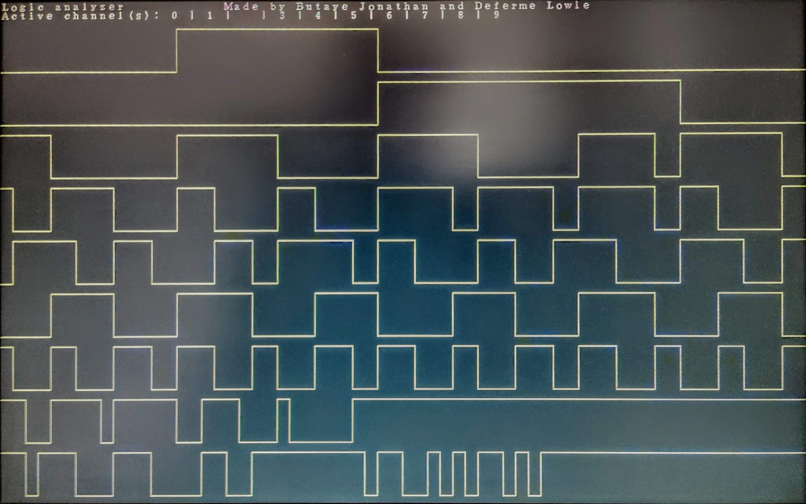
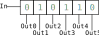

# Logic Analyzer

*Butaye Jonathan & Deferme Lowie*



## Structure

TODO: Explain overview


### Top level design file

This file sits in `./src/boardspecific` and therefore isn't present in the repo, however the folder contains a [readme](../src/boardspecific/README.md) with an example of this file.

The top lever design file contains a phase locked loop in order to provide the correct clock for the VGA display. Furthermore necessary IO's are forwarded to the `logic_analyzer` module here. 

### Logic analyzer

[`logic_analyzer`](../src/logic_analyzer.v) is the main module of this project. It uses the physical inputs to generate vga output as seen in the definition below:

```Verilog
module logic_analyzer (
    clk,          // input ---> clock
    reset,        // input ---> asynchronous reset
    chan_enable,  // input ---> array with an enable for each channel
    chan_in,      // input ---> input signal of each channel
    trig_enable,  // input ---> enable triggering (data reading)
    vga_r,        // output --> vga red signal
    vga_g,        // output --> vga green signal
    vga_b,        // output --> vga blue signal
    vga_hsync,    // output --> vga horizontal sync
    vga_vsync     // output --> vga vertical sync
);
```

TODO

### Vga timing generator

TODO

### Data to pixelstatus

TODO

### Pixel to channel

TODO

### Sipo shift register

[This register](../src/sipo_shift_register.v) shifts one to the left when the `shift` input becomes `1`. Sipo is an acronym for "Serial In Parallel Out", this means that bits are read into the register in a serial fashion but the whole register is available as output.



## Description of headers

### Config

[`config.h`](../src/config.h) contains general configuration parameters.

### VGA

[`vga.h`](../src/vga.h) defines the vga timing information.